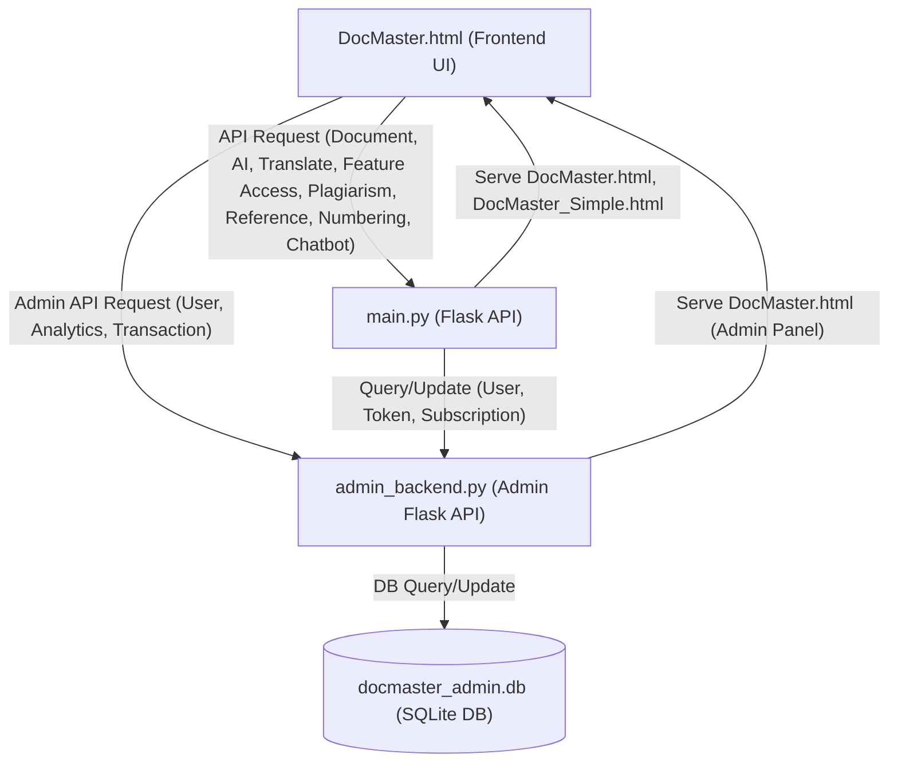
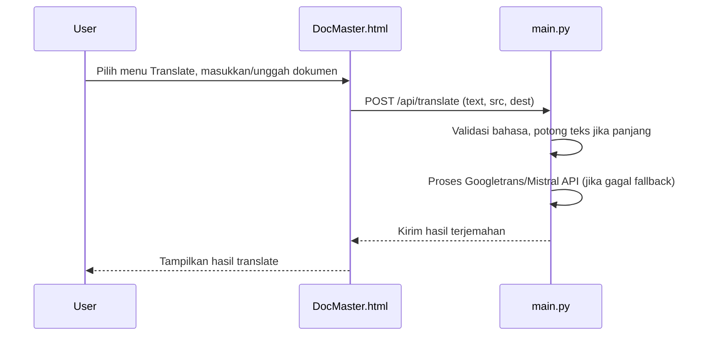
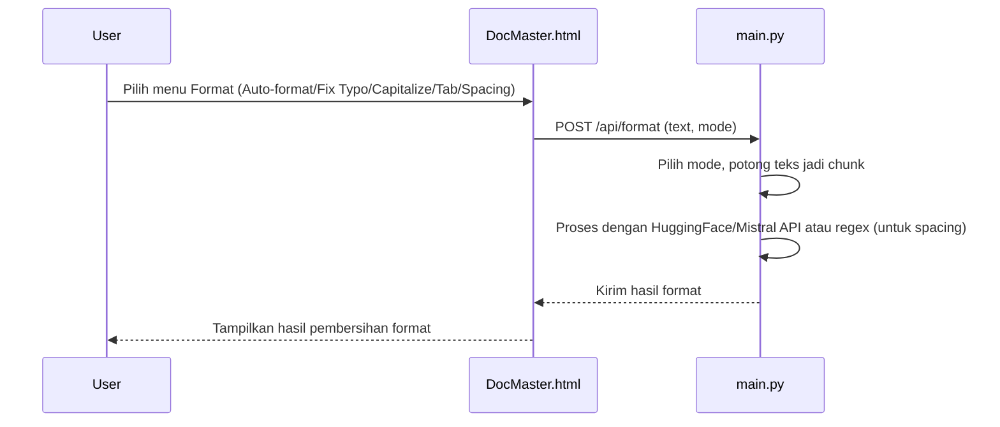
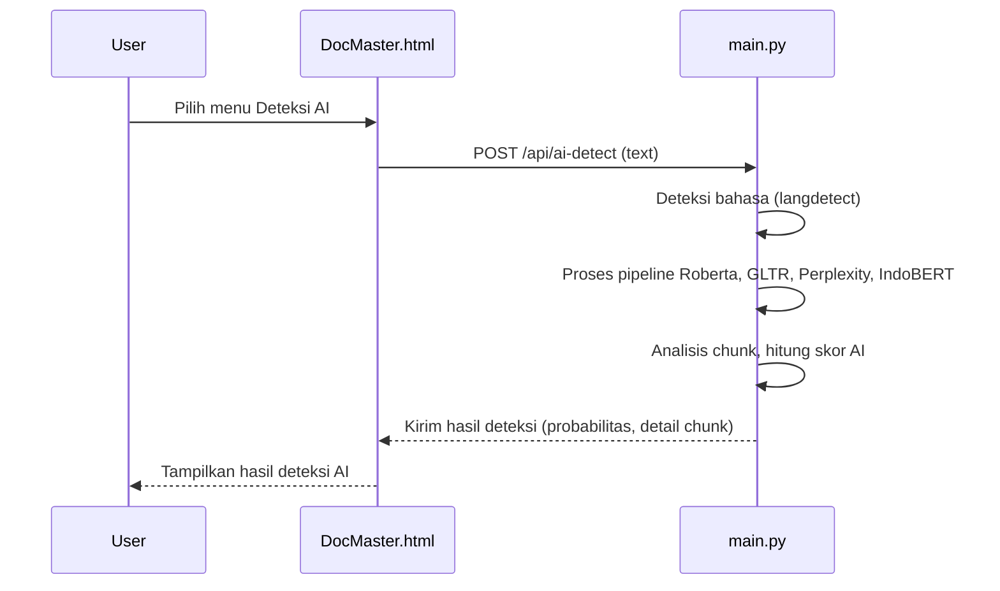
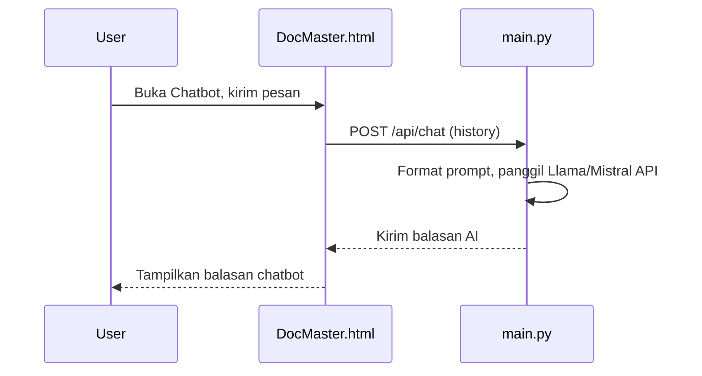

# DocMaster System Flowchart & Detailed Feature Workflows (Mermaid)

## 1. System Architecture Overview

---

## 2. Feature Workflows (Detail)

### 2.1. Document Translation

### 2.2. Format Cleaning (Auto-format, Fix Typo, Capitalize, Tab, Spacing)

### 2.3. AI Content Detection (Deteksi Konten AI)

### 2.4. AI Assistant (Chatbot)

---

## 3. Penjelasan Detail Fitur

### Translate Dokumen
- Mendukung input teks langsung atau file dokumen (docx/pdf/doc, diubah ke teks dulu)
- Menggunakan Googletrans (gratis) atau fallback ke Mistral API jika error/limit
- Memotong teks panjang menjadi bagian kecil agar tidak error
- Mendukung banyak bahasa (id, en, ja, zh, ar, es, fr, de, ru, ko, it, pt)

### Pembersihan Format (Auto-format, Typo, Kapital, Tab, Spasi)
- Mode auto-format: merapikan struktur dokumen, heading, spasi, indentasi, ejaan
- Mode fix typo: memperbaiki typo/ejaan (bahasa Inggris: LanguageTool, lain: Mistral)
- Mode capitalize/tab: kapitalisasi awal kalimat/tab otomatis (Mistral)
- Mode fix spacing: regex untuk menghapus spasi berlebih
- Semua mode memotong teks panjang menjadi chunk agar efisien

### Deteksi Konten AI
- Deteksi apakah teks hasil AI (ChatGPT, Llama, dsb) atau manusia
- Menggunakan pipeline Roberta, GLTR, Perplexity, IndoBERT (khusus Indonesia)
- Analisis per chunk, hasil berupa probabilitas dan highlight bagian AI
- Mendukung deteksi otomatis bahasa (langdetect)

### AI Assistant (Chatbot)
- Chatbot profesional dokumen, gaya ramah, bisa emoji
- Menggunakan Llama/Mistral API via OpenRouter
- Mendukung riwayat chat (history) untuk konteks
- Balasan AI diformat agar mudah dibaca, tidak pakai markdown

---

## 4. Catatan
- Semua endpoint API di-handle oleh `main.py` (fitur user) dan `admin_backend.py` (fitur admin)
- Operasi database (user, token, subscription, analytics, transaksi) dikelola oleh `admin_backend.py` dan disimpan di `docmaster_admin.db`
- Fitur AI/ML memakai HuggingFace, OpenRouter (Mistral/Llama), dan library Python lain
- Frontend (`DocMaster.html`) berinteraksi dengan backend via REST API
- Kontrol akses fitur berdasarkan status premium/token
- Panel admin menyediakan monitoring real-time, analytics, dan ekspor data

---

> **Cara pakai:**
> - Simpan file ini di repo Anda (misal: `DocMaster_Flowchart.md`)
> - Lihat di GitHub atau Markdown viewer yang support Mermaid untuk diagram
> - Update jika ada fitur baru
