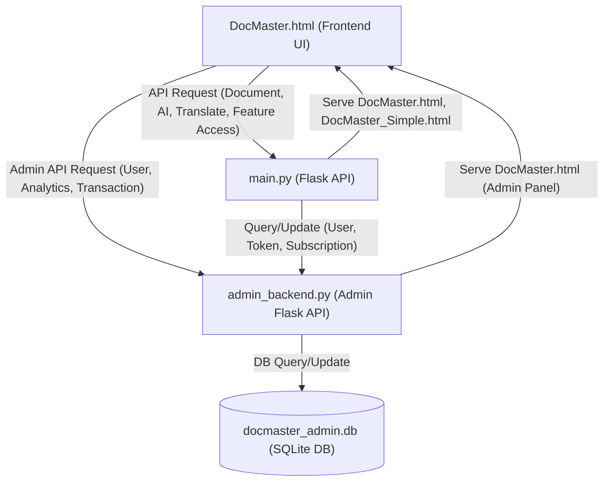

# DocMaster System Flowchart (Mermaid)

> **Note:**
> - This diagram shows the main signal/data flow between the frontend (`DocMaster.html`), the main backend (`main.py`), the admin backend (`admin_backend.py`), and the database. The price banner is excluded as requested.
> - Place this code block in your `README.md` or a `.md` file on GitHub to render the Mermaid diagram.
