# DocMaster System Flowchart & Detailed Feature Workflow (Mermaid)

## 1. System Architecture Overview

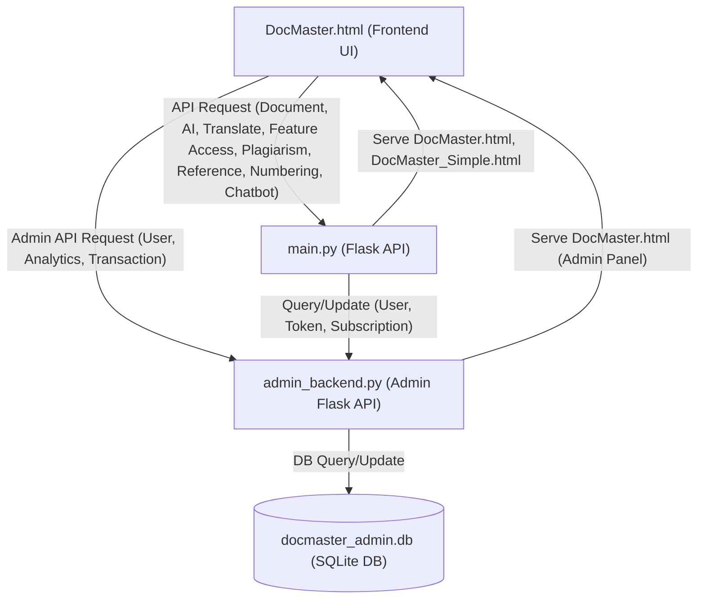

---

## 2. Feature Workflows

### 2.1. Document Upload & Parsing

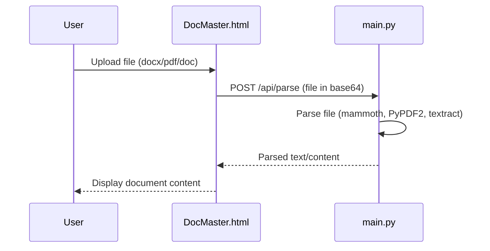

### 2.2. AI Document Processing (Auto-format, Typo Fix, Capitalize, Tab, etc)

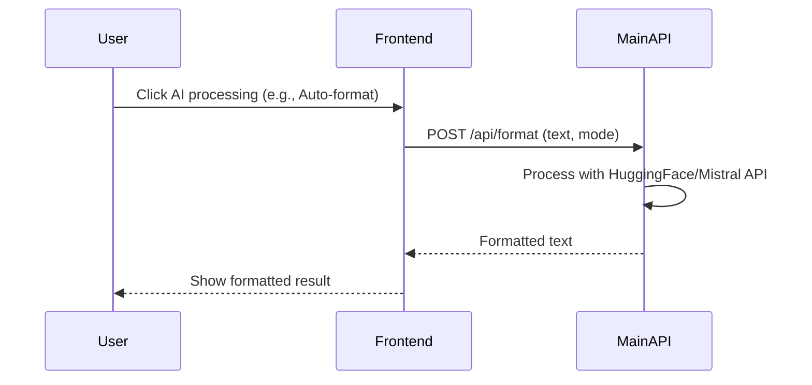

### 2.3. Translation

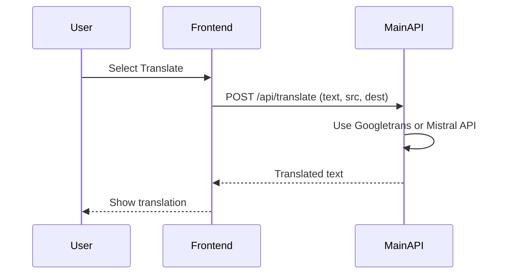

### 2.4. Plagiarism/Similarity Check

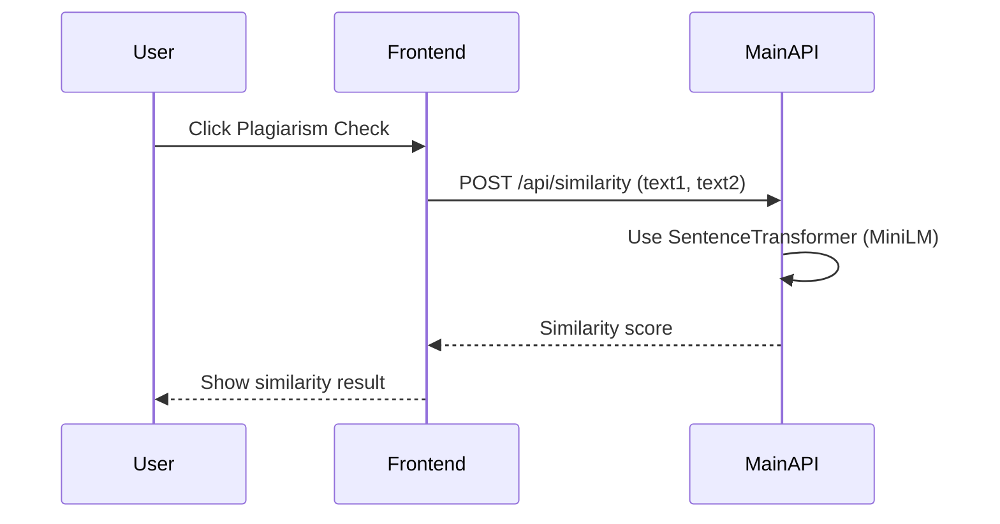

### 2.5. AI Detection (Is this text AI-generated?)

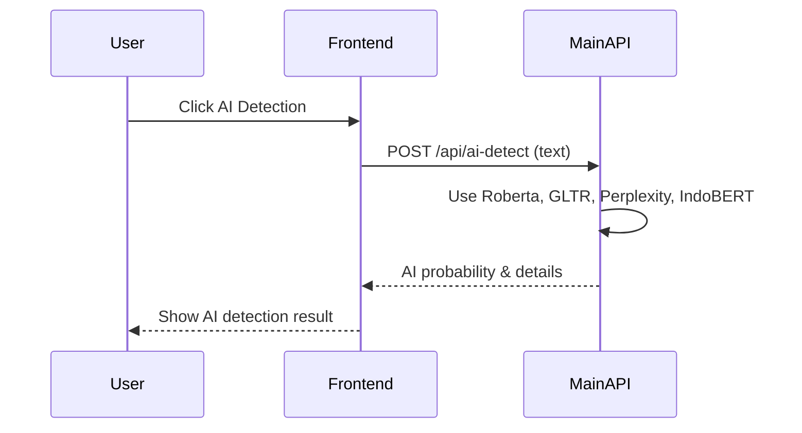

### 2.6. Reference Parsing & Formatting

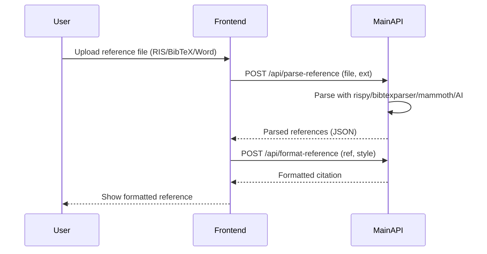

### 2.7. Page Numbering

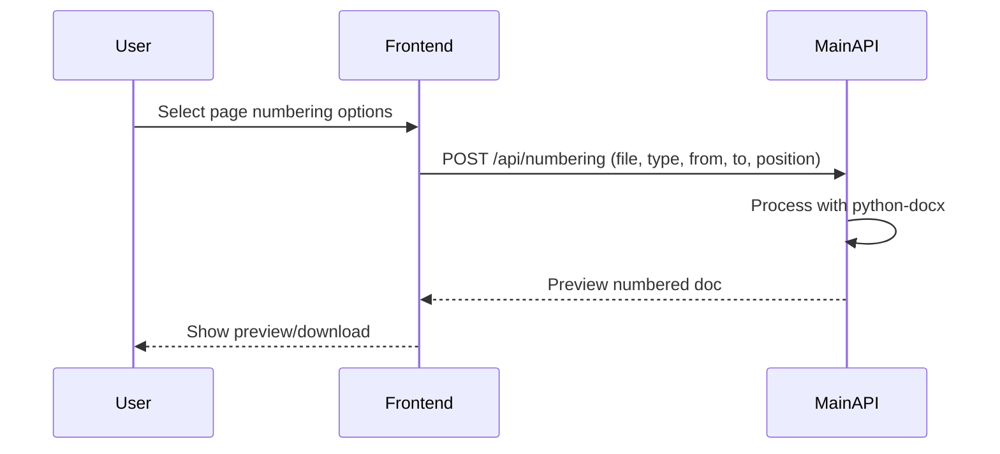

### 2.8. Chatbot (AI Assistant)

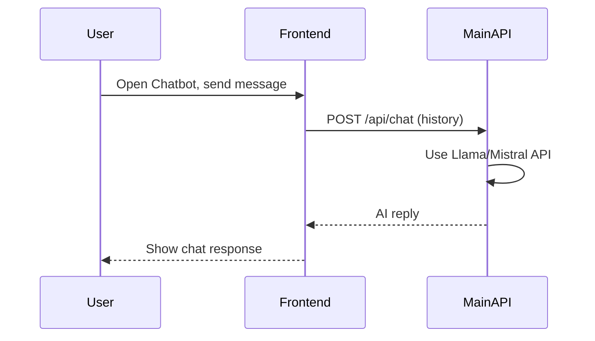

### 2.9. Feature Access Control (Premium/Token)

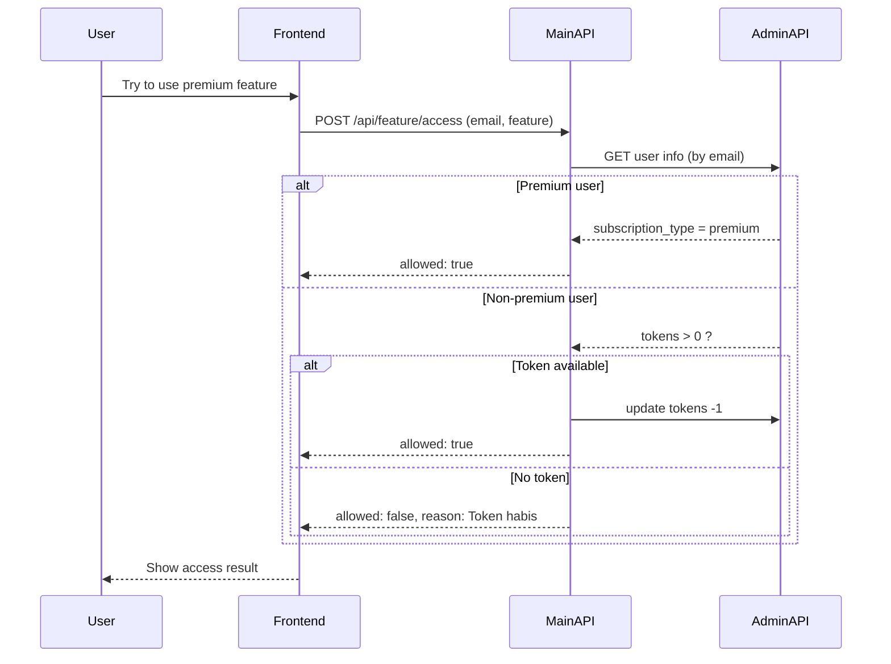

### 2.10. Admin Panel (Monitoring, Analytics, Transactions)

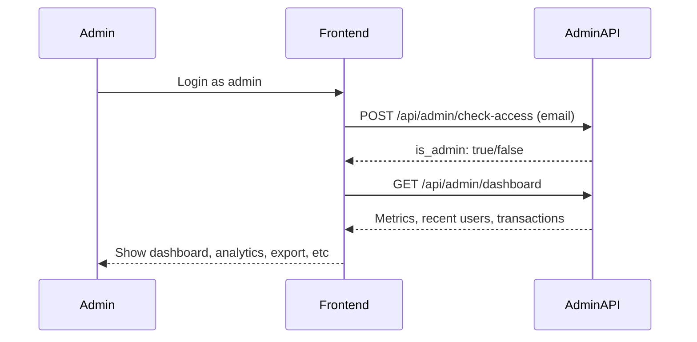

---

## 3. Notes
- All API endpoints are handled by `main.py` (user features) and `admin_backend.py` (admin features).
- Database operations (user, token, subscription, analytics, transactions) are managed by `admin_backend.py` and stored in `docmaster_admin.db`.
- AI/ML features use HuggingFace, OpenRouter (Mistral/Llama), and other Python libraries.
- The frontend (`DocMaster.html`) interacts with both backends via REST API.
- Feature access is controlled by premium status or token count.
- Admin panel provides real-time monitoring, analytics, and data export.

---

> **How to use:**
> - Place this file in your repository (e.g., `DocMaster_Flowchart.md`).
> - View on GitHub or any Mermaid-compatible Markdown viewer for rendered diagrams.
> - Update as new features are added.
